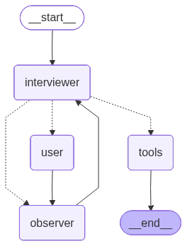

# Мультиагентная LLM-система для проведения технических интервью

## Краткое описание
Разработана **мультиагентная система** для проведения технического интервью с использованием LangGraph, состоящая из **Interviewer** и **Observer**:

- **Interviewer** — напрямую взаимодействует с кандидатом, задаёт вопросы и формирует итоговый вердикт.
- **Observer** — оценивает ответы кандидата, проверяет корректность и честность ответов, рекомендует темы и уровень сложности следующих вопросов, принимает решение о завершении интервью.

---

## Цели системы
  - Адаптивная генерация вопросов, соответствующих заявленному опыт, на основе ответов кандидата    
  - Совместное рассуждение агентов для формирования наиболее подходящих вопросов
  - Контроль честности и достоверности ответов  
  - Объяснимый, полезный и структурированный итоговый вердикт на основании всех ответов кандидата
  - Автоматическое логирование всех итераций интервью
---

## Структура графа

  - **Узел user** — выдает кандидату вопрос и получает его ответ  
  - **Узел interviewer** — задаёт вопросы, ведет диалог с Обсервером, использует tools  
  - **Узел observer** — анализирует ответы, проверяет честность, выделяет данные кандидата и даёт рекомендации  
  - **Tool-узел** — формирует итоговый вердикт в случае, если Обсервер решил завершить интервью
---

## Архитектура системы

### 1. Интервьюер

**Роль:**  
- Ведёт диалог с кандидатом  
- Получает рекомендации от Обсервера
- Ведет диалог с Обсервером 
- Определяет следующий вопрос
- Формирует итоговый вердикт  

**Поведение:**  
- Может принять рекомендации Обсервера или задать уточняющий вопрос  
- Ведёт диалог с Обсервером до согласования темы вопроса
- Задает вопросы согласно рекомендациям Обсервера и ответам кандидата  

**Входные данные:**  
- История диалога

**Выходные данные:**  
- Следующий вопрос кандидату  
- Вопросы Обсервера  
- Итоговый вердикт  

### 2. Обсервер

**Роль:**  
- Оценивает ответы кандидата  
- Проверяет **честность ответа**, предотвращает использование AI и выдумывание фактов  
- Контролирует, чтобы кандидат **не уходил от темы вопроса**  
- Выделяет данные кандидата:
  - имя  
  - заявленный опыт
  - заявленный уровень 
  - желаемая позиция  
- Рекомендует темы и сложность следующих вопросов  
- Определяет, когда интервью следует завершить  

**Поведение:**  
- Адаптирует рекомендации под уровень кандидата  
- Может инициировать завершение интервью  
- Поддерживает диалог с Интервьюером до согласования темы  

**Входные данные:**  
- История диалога  

**Выходные данные:**  
- Рекомендации по теме и сложности  
- Решение о завершении интервью  
- Извлечённые данные кандидата  

---

## Управление состоянием

Система хранит:

- Историю диалога агентов  
- Вопросы для кандидата
- Ответы кандидата  
- Выделенные данные кандидата:
  - имя
  - заявленный опыт
  - заявленный уровень 
  - желаемая позиция
    
---

## Используемые технологии

- **LangGraph**, **LangChain** — построение графа состояний  
- **LLM (qwen3-32b, gpt-oss-120b)** — генерация вопросов, анализ ответов, контроль честности, принятие решений, использование Tool, формирование вердикта
- **Python** — основной язык реализации

---
> Полный пример работы системы, включая взаимодействие агентов и выделенные данные кандидата, можно посмотреть в папке [`logs`](system/logs).
